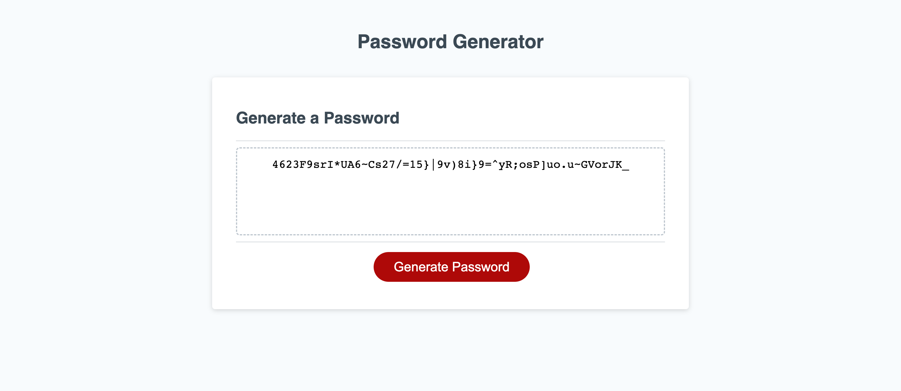
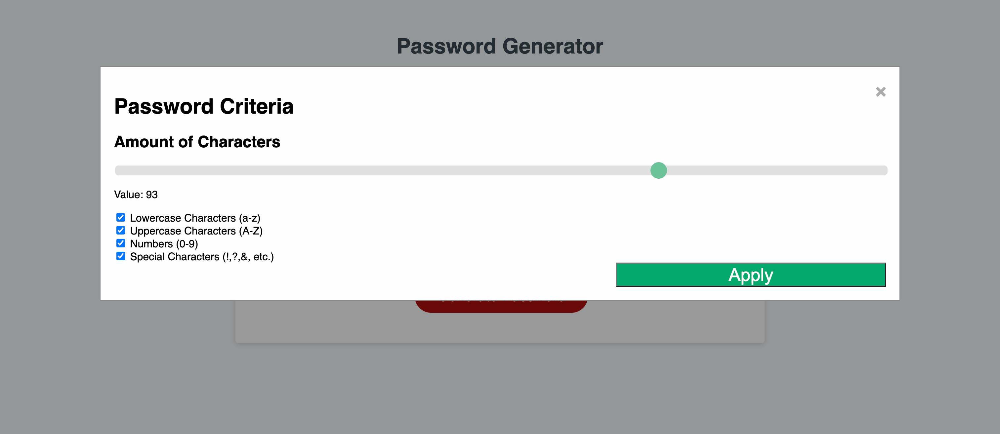

# Password Generator

## Description

My motivation behind this project was to further apply my Javascript skills. This project allowed me to create functionally to a website. This website can now be used by the public to generate a password of selected criteria of their choosing. It can create complex passwords for users to have added security to their password protected log-ins. I learned how to apply js array methods, create functions, and use my research skills to my fullest extent. 

## Deployed Website

The following is a screenshot and url of the deployed website: 

- https://albertosuarez8.github.io/Module-3-Challenge/

## Credits

- [Starter code provided by UCF Coding Bootcamp](https://github.com/coding-boot-camp/friendly-parakeet)
- W3Schools deems fair use of their copyrighted material when it is linked like the following. For more information please visit [W3Schools Terms of Service](https://www.w3schools.com/about/about_copyright.asp).
    - [Modal code provided by W3Schools](https://www.w3schools.com/howto/howto_css_modals.asp)
    - [Range slider code provided by W3Schools](https://www.w3schools.com/howto/howto_js_rangeslider.asp)